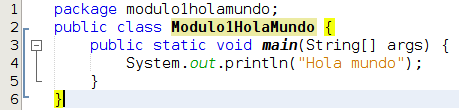

# ... vamos allá

Como hemos indicado con anterioridad en este curso vamos a utilizar NetBeans como entorno de desarrollo así que ha llegado el momento de familiarizarnos con él y crear nuestro primer programa. En el siguiente videotutorial se muestran aquellas funcionalidades de NetBeans que utilizaremos en el curso y crearemos nuestro primer programa. En este mismo capítulo, con posterioridad al vídeo, desgranaremos este programa.

https://youtu.be/plwtjTiiXwo

Voy a extraer el código del programa realizado en el vídeo para comentarlo con mayor detalle. Voy a quitar los comentarios con el fin de facilitar la lectura del código y centrarnos en lo relevante en este momento.

La primera línea hace referencia al **paquete** al que pertenece nuestro fichero. Hablaremos de la organización del código en capítulos posteriores.

En la segunda línea **defino la clase** Modulo1HolaMundo con la palabra reservada class, es importante fijarse que tras la definición de la clase abrimos una llave { que cerramos en la línea 6 } Todo lo contenido entre esas llaves pertenece a la clase. No comento nada de la palabra reservada public ya que la veremos mas adelante pero si es importante reseñar que **el nombre de la clase debe coincidir con el nombre del fichero**. En un mismo fichero puede definirse mas de 1 clase pero solo 1 de ellas será pública.

En la tercera línea creo un **método** llamado main que pertenece a la clase Modulo1HolaMundo. En java para definir un método debemos definir el tipo que devuelve, el nombre y los argumentos que requiere. Posteriormente abrimos una llave { que cerramos en la línea 5 }, todo lo que se encuentra dentro de ambas llaves pertenece al método main En este caso el tipo que devolvemos es void (nada), el nombre de la función es main y tenemos un argumento llamado args de tipo String\[\]. Los modificadores public y static los dejamos para capítulos posteriores. El **método main es un método especial**, es el que se ejecutará en nuestro programa cuando iniciemos este. En caso de que nuestro proyecto tenga mas de un método main para configurar cual queremos que se ejecute al iniciar el proyecto deberemos dirigirnos a las propiedades del proyecto (properties), seleccionar ejecución (Run) y allí establecer la clase principal (Main Class) que queremos que se ejecute.

En la cuarta línea hago una llamada al sistema y le digo que escriba por pantalla en una línea la frase Hola mundo. Es muy común al principio olvidar el ; del final de la línea.

