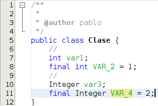
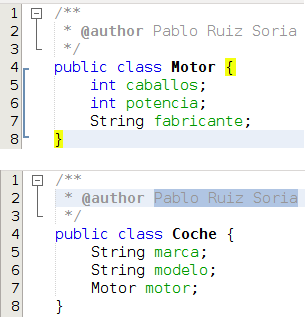

# Atributos

Anteriormente hemos indicado que una clase puede contener o no atributos (también llamados campos o variables miembro) y que estos atributos podían ser de tipo primitivo o bien otras clases.

Vamos a ver un ejemplo:

En la clase Clase existe var1 (línea 7) que es un atributo variable de tipo int (tipo primitivo). Existe VAR\_2 (línea 8) que es un atributo constante de tipo int (tipo primitivo). Existe var3 (línea 10) que es un atributo variable de la clase Integer y, por último, existe VAR\_4 (línea 11) que es un atributo constante de la clase Integer. Aquí he utilizado la clase Integer perteneciente al API de Java, pero si tuviese creadas varias clases podría crear variables de la clase que me interesase. Vamos a ver otro ejemplo:

En la imagen anterior vemos 2 clases. La clase Motor, que tiene 3 atributos, y la clase Coche, con otros 3 atributos. Si nos fijamos en la línea 7 de la clase Coche veremos que uno de sus atributos es de tipo Motor. En este caso se dice que la clase Coche está compuesta por la clase Motor, no confundir con la herencia (la tratamos mas adelante)

Las clases pueden contener atributos estáticos, para ello antes del tipo utilizaremos la palabra reservada static, pero de esto hablaremos mas adelante.

