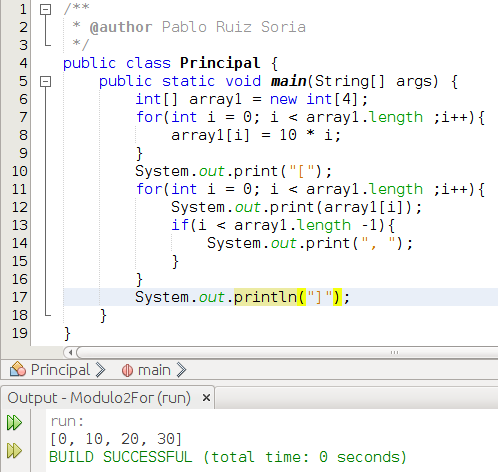
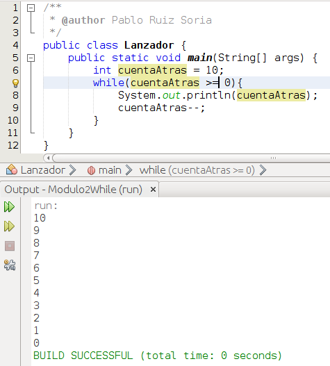
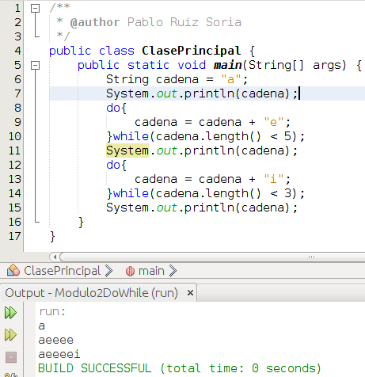

# Bucles

Ha llegado el momento de hablar de los bucles y de sus distintas formas en Java.

Lo primero es definir que es un bucle, en la wikipedia podemos encontrar la siguiente definición de bucle:

> Un bucle o ciclo, en programación , es una sentencia que se realiza repetidas veces a un trozo aislado de código, hasta que la condición asignada a dicho bucle deje de cumplirse.
> 
> https://es.wikipedia.org/wiki/Bucle_(programaci%C3%B3n)

Ahora que sabemos lo que es vamos a ver los distintos bucles existentes en Java. Vamos a comenzar con el bucle **for**. Su sintaxis es la siguiente:

```java
for(iniciacion; condicionFin; accionSobreIniciacion){
    sentencias;
}
```

En iniciacion deberemos establecer el valor inicial que queremos dar a nuestra variable de control. En condicionFin deberá haber alguna condición lógica y en accionSobreIniciacion deberemos establecer que queremos que pase tras cada iteracción. En sentencias estableceremos las sentencias de código que necesitemos. No se considera una buena práctica modificar la variable de iniciación en las sentencias. Una vez mas, vamos a reforzar la explicación con un ejemplo que incluya código con el fin de facilitar la compresión.





Vamos a analizar esta pieza de código. En la línea 6 creamos un array de 4 posiciones (tal como vimos en el apartado Arrays). En la línea 7 tenemos un bucle for y en el nos encontramos int i = 0, esto hace que solo la primera vez que se accede al bucle se cree una variable llamada i que valga 0. Posteriormente se evalúa la condición array1.length (nos devuelve la longitud del array) y como es verdad (0 es menor que 4) se procede a ejecutar las sentencias del interior del for. En este caso se trata de una única sentencia que lo que hace es establecer un valor en la posición del array. Una vez se han ejecutado todas las sentencias de dentro de bucle for se ejecuta i++ y se reevalúa la condición, si esta es cierta se vuelven a ejecutar las sentencias del bucle y así hasta el momento en que la condición sea falsa, momento en el cual se sale del bucle. En la línea 10 escribimos por pantalla un corchete y posteriormente, en el bucle, recorremos las posiciones del array mostrando su valor y además en caso de que no se trate de la última posición del array añadimos una coma. Cuando termina el bucle se añade el cirre del corchete antes escrito. Voy a escribir lo que ocurre en el primer bucle for de un modo menos prosaico a continuación:

1º Se crea una variable llamada i y se le asigna el valor 0

2º Se comprueba que la variable i (que vale 0) sea menor a array1.length (que vale 4). Es verdad.

3º Ejecuto array1\[i\] = 10 * i; es decir, en la posición 0 del array1 pongo el resultado de multiplicar 10 * 0.

4º Hago i++. i pasa a valer 1.

5º Se comprueba que la variable i (que vale 1) sea menor a array1.length (que vale 4). Es verdad.  

6º Ejecuto array1\[i\] = 10 * i; es decir, en la posición 1 del array1 pongo el resultado de multiplicar 10 * 1.

7º Hago i++. i pasa a valer 2.

8º Se comprueba que la variable i (que vale 2) sea menor a array1.length (que vale 4). Es verdad.

9º Ejecuto array1\[i\] = 10 * i; es decir, en la posición 2 del array1 pongo el resultado de multiplicar 10 * 2.

10º Hago i++. i pasa a valer 3.

11º Se comprueba que la variable i (que vale 3) sea menor a array1.length (que vale 4). Es verdad.

12º Ejecuto array1\[i\] = 10 * i; es decir, en la posición 3 del array1 pongo el resultado de multiplicar 10 * 3.

13º Hago i++. i pasa a valer 4.

14º Se comprueba que la variable i (que vale 4) sea menor a array1.length (que vale 4). Es falso, se sale del bucle.

En Java existe otra manera de trabajar con bucles for, vamos a ver la sintaxis a continuación pero veremos ejemplos en el apartado de estructuras de almacenamiento de datos.

for(tipoVariable nombreVariable : listaQueContieneVariablesDeTipoVariable){
    sentencias;
}

* * *

Una vez hemos visto las posibilidades que nos ofrece el bucle for vamos a ver los **bucles while**. Los bucles while tienen la siguiente sintaxis:

```java
while(condicion){
    sentencias;
}
```

En un bucle while las sentencias de su interior se van a estar ejecutando siempre mientras la condición del while sea verdadera. Por ello, salvo que queramos hacer un bucle infinito, en las sentencias actuaremos sobre la variable o variables que participen en la condición. Vamos a ver un ejemplo:





Lo que ocurre en el código de la imagen es lo siguiente. En la línea 6 creamos una variable de tipo entero con valor 10. En la línea 7 se evalúa que la variable antes creada sea mayor o igual a 0. Si es verdad, se ejecutan las sentencias de las líneas 8 y 9. Si es falso, se sale del bucle while.

* * *

En último lugar vamos a hablar de los bucles **do-while**. Estos bucles tienen la siguiente sintaxis:

```java
do{
    sentencias;
}while(condicion);
```

Los bucles do-while son prácticamente iguales a los bucles while con la salvedad de que en un bucle do-while las sentencias contenidas dentro del mismo se van a ejecutar siempre 1 vez y luego se seguirán ejecutando mientras la condición sea verdadera. Al igual que en el caso anterior, salvo que queramos hacer un bucle infinito, en las sentencias deberemos actuar sobre la variable o variables que participen en la condición.





Vamos a analizar que sucede en este código. En la línea 6 creamos una variable de tipo String con el valor a. En la línea 7 mostramos en una línea el valor de nuestra variable cadena. Entre las líneas 8 y 10 nos encontramos un bucle do-while, procedemos ejecutando todo lo que está dentro del bucle por lo que a nuestra variable cadena le añadimos una e al final, ahora evaluamos la condición. Si la condición es cierta volvemos a ejecutar todas las sentencias contenidas dentro del do-while. Si la condición es falsa hemos terminado con el do-while. En la línea 11 mostramos en una línea el valor de nuestra variable cadena. Entre las líneas 12 y 14 nos encontramos otro bucle do-while, así que antes de nada ejecutamos las sentencias de su interior, en este caso a nuestra variable cadena le añadimos una i al final y una vez hemos ejecutado las sentencias procedemos a evaluar la condición.Si la condición es cierta volvemos a ejecutar todas las sentencias contenidas dentro del do-while. Si la condición es falsa hemos terminado con el do-while. En la línea 15 mostramos en una línea el valor de nuestra variable cadena.

Presta atención a este detalle: Para conocer el tamaño de un array utilizamos nombreVariableDeTipoArray.length mientras que para conocer la longitud de una cadena utilizamos nombreVariableTipoString.length(). La diferencia radica en el uso del paréntesis. Es algo que en nuestros primeros pasos con Java puede ocasionarnos algún pequeño trastorno.

