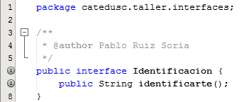
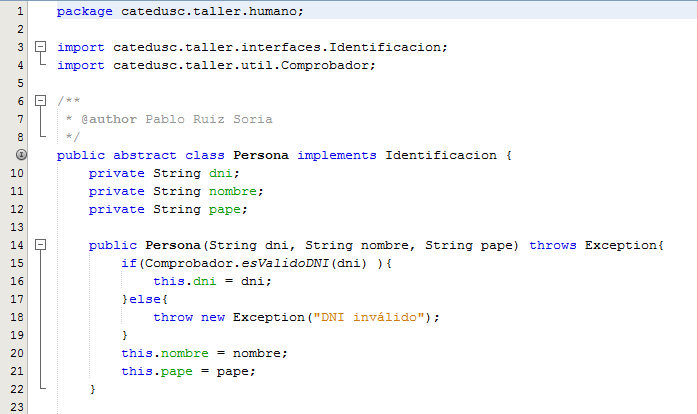
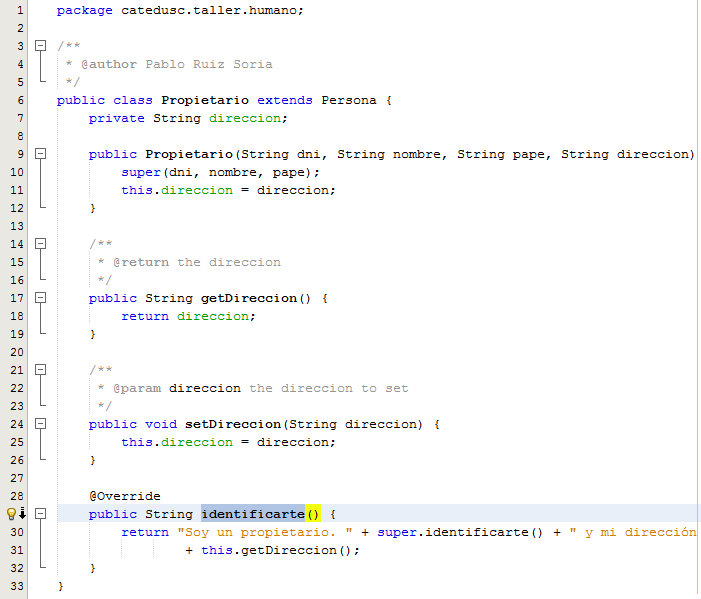

# Codificación

Una vez que tenemos esquematizada la solución de nuestro programa es el momento de codificarla. En esta sección voy a añadir imágenes de las partes que considero mas relevantes para solucionar nuestro problema. En el apartado "Código utilizado en los ejemplos" podréis descargar el código completo del proyecto.

El código anterior es la implementación de la interface Identificación. En ella vemos que aparece la firma de la función identificarte. Como ya sabemos a estas alturas todas las clases que implementen esta interface estarán obligadas a implementar esta función.

Vamos a contnuar con la clase abstracta Persona que implementa la interface anterior.

Como vemos en esta clase indicamos que es una clase pública y abstracta que implementa la interface Identificacion. En esta clase tenemos 3 atributos que siguen los principios de la encapsulación y en la imagen vemos que la clase tiene un único constructor que obliga a definir una Persona a través de 3 argumentos. Como ya sabemos, al tratarse de una clase abstracta no podremos crear objetos de esta clase. La clase Vehículo sería similar a esta clase que acabamos de analizar.

Vamos a continuar con el código de la clase Propietario que hereda de la clase anterior y se verá obligada a implementar el método de la interface Identificacion.

Vemos en la línea 6 que se trata de una clase pública que extiende a la clase Persona (que a su vez implementaba a Identificacion). Al heredar de Persona dispondremos de acceso a aquellos atributos y métodos no privados. Si nos fijamos en el constructor vemos que hemos de llamar a super (línea 10) para que se llame al constructor de la superclase de Propietario (Persona). Observamos también en las líneas 28 a 32 la implementación del método de la interface. Del mismo modo que construimos la clase Propietario procederíamos con la clase Cliente.

Una vez hemos creado todas nuestras clases únicamente necesitaríamos disponer de una clase con un método main que nos permitiese interactuar con las clases que hemos definido para poder crear objetos a partir de ellas. En el apartado "Código utilizado en los ejemplos" he añadido 2 clases que nos permiten lanzar la aplicación, la clase Inicio.java contiene una interfaz de tipo texto y la clase igu contiene una interfaz gráfica de usuario limitada. El código se encuentra documentado para facilitar su comprensión.

En el siguiente apartado vamos a ver como crear esta interfaz gráfica de usuario a la que hago referencia en el párrafo anterior.

