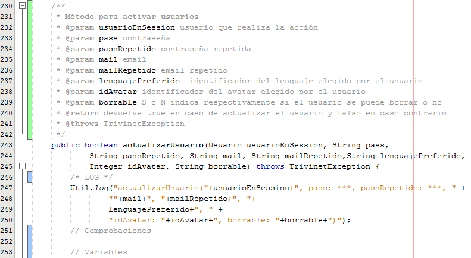

# Comentarios

Los comentarios los introduciremos en nuestro código fuente para facilitar la lectura y comprensión posterior del código. La redacción de estos comentarios también van a facilitar en la posterior elaboración de la documentación del código.

¿Cómo se indica en un programa que algo es un comentario? Existen distintos modos de hacerlo:

*   Comentarios de línea: Todo lo que, en una línea, esté detrás del símbolo // se considerará un comentario y ni el compilador ni el intérprete lo tendrán en cuenta.
*   Comentarios de bloque: Todo lo que esté comprendido entre el símbolo /* y el símbolo */ se considerá un comentario y ni el compilador ni el intérprete lo tendrán en cuenta.
*   Comentarios de documentación: Todo lo que esté comprendido entre el símbolo /** y el símbolo */ se considerará un comentario de documentación y en la generación de documentación y en la autoayuda del IDE netbeans nos proporcionará información extra.

Vamos a ver un extracto de código que contiene comentarios:

Entre las líneas 230 y 242 tenemos un comentario de documentación. En este tipo de comentarios, además de explicar para que sirve una función se puede detallar información adicional a través de anotaciones como @param @return o @throws que sirven respectivamente para indicar los parámetros de la función, lo que devuelve la función y el tipo de excepción o excepciones que lanza la función.

En la línea 246 tenemos un ejemplo de comentario de bloque.

En las líneas 251 y 253 tenemos ejemplos de comentarios de línea.

**Es muy importante** concienciarnos a nosotros/as y a nuestro alumnado de la importancia de documentar el código para que quede reflejada la funcionalidad del código escrito y así facilitar su posterior mantenimiento.

