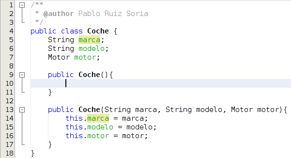

# Constructores

Vamos a ver que **definición** de constructor encontramos en la wikipedia:

> En programación orientada a objetos (POO), un constructor es una subrutina cuya misión es inicializar un objeto de una clase. En el constructor se asignan los valores iniciales del nuevo objeto.
> 
> https://es.wikipedia.org/wiki/Constructor_(inform%C3%A1tica)

 Es decir, **el constructor nos va a permitir crear una instancia de una clase (un objeto)**. Un constructor es un método especial. Vamos a ver su sintaxis:

```java
modificadorDeAcceso NombreDeLaClase(OpcionalmenteParámetros){  
    sentencias;  
}
```

Voy a ilustrarlo con un ejemplo:





En la imagen anterior la clase Coche tiene 2 constructores. Un constructor vacío entre las líneas 9 y 11 y un constructor con todos sus parámetros entre las líneas 13 y 17. Por lo que podremos crear objetos de cualquiera de los 2 modos que vemos a continuación:

```java
Coche coche = new Coche();  
Coche coche2 = new Coche( "Ford", "Grand CMAX", new Motor() );
```

**Cuando una clase no tiene escrito ningún constructor el compilador asume que la clase en cuestión tiene el constructor vacío**. Es decir, si en el ejemplo anterior suprimimos las líneas 9 a 17 sería equivalente a dejar las líneas 9 a 11 y podríamos crear objetos únicamente así:

```java
Coche coche3 = new Coche();
```

Sin embargo, si en el ejemplo anterior suprimimos las líneas 9 a 11 el único constructor que tendrá la clase será el que obliga a dar valor a todos sus atributos, es decir, sólo podríamos utilizar el siguiente modo para crear objetos:

```java
Coche coche4 = new Coche( "Ford", "Fiesta", new Motor() );
```

Antes comenté que eran métodos especiales porque si te fijas la sintaxis es igual a la de los métodos con la salvedad de que no se indica el tipo de dato que devuelve y esto es así porque un constructor siempre devuelve como tipo de dato una instancia de la propia clase.

En las líneas 14 a 16 hago uso de la palabra reservada **this**. Cuando en la línea 14 escribo this.marca me estoy refiriendo a la variable marca de la clase y no al parámetro marca. Es decir, cuando escribo this.marca = marca; estoy diciendo que la variable marca de la clase pase a valer lo que valga el parámetro marca. Además de this, en un constructor podemos encontrarnos la palabra reservada **super**, pero el uso de esta lo veremos cuando hablemos de herencia.

En este curso siempre vamos a utilizar el modificador de acceso public para los constructores. Si quieres ver cuando podría tener sentido tener un constructor de acceso privado (private) puedes leer acerca del [patrón de diseño](https://es.wikipedia.org/wiki/Patr%C3%B3n_de_dise%C3%B1o "Patrón de diseño") [Singleton](https://es.wikipedia.org/wiki/Singleton "Singleton").

