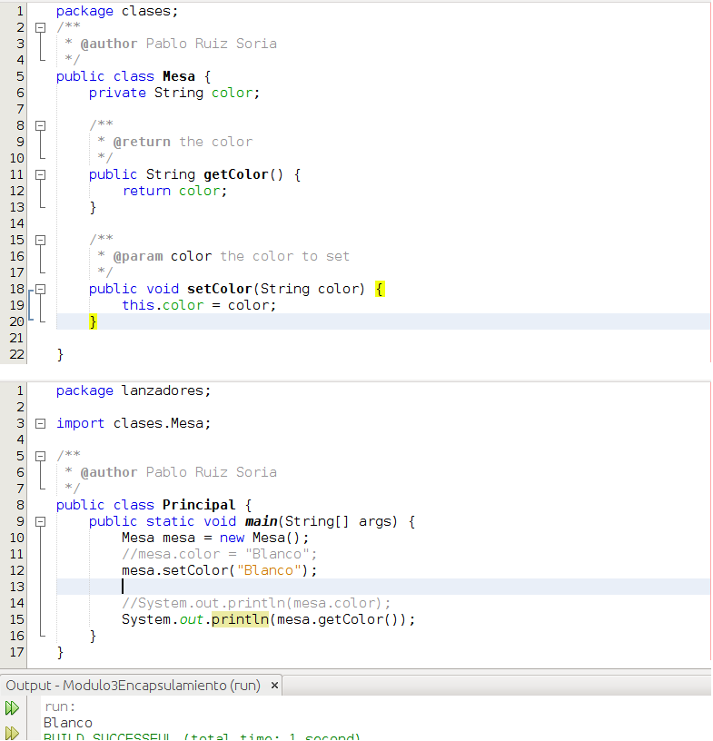
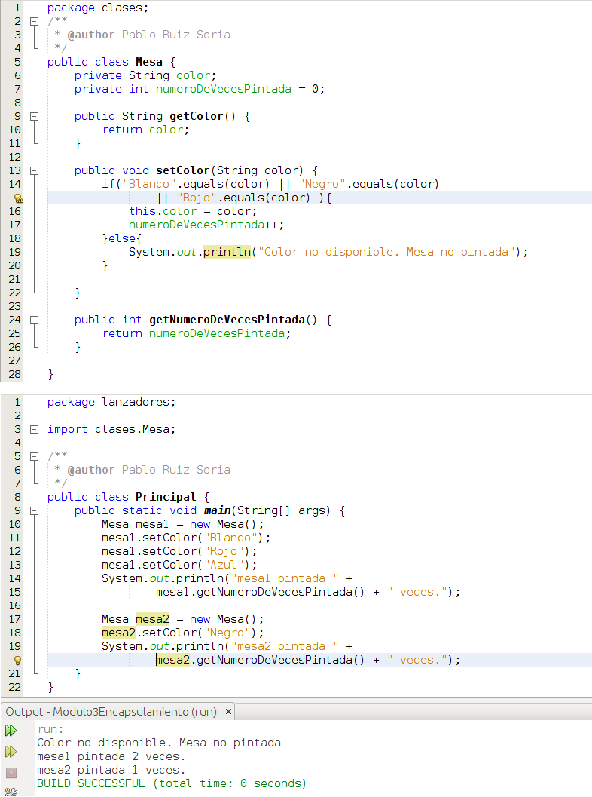

# Encapsulamiento

La encapsulación es un principio fundamental de la programación orientada a objetos y consiste en ocultar el estado interno del objeto y obligar a que toda interacción se realice a través de los métodos del objeto.

En el código que hemos desarrollado hasta el momento hemos dado libre acceso a los atributos de nuestros objetos lo cual presenta riesgos ya que no tenemos ningún tipo de control sobre lo que puede o no hacerse con ellos. Nos va a interesar que a nuestros atributos solo se pueda acceder a través de los métodos, de modo que obtengamos control sobre lo que puede hacerse con los atributos.

Para ello, el acceso a los atributos se establece como privado y se crean 2 métodos por cada atributo, un **getter** y un **setter**. El getter de un atributo se llamará getNombreAtributo mientras que el setter de un atributo se llamará setNombreAtributo. Vamos a ver un ejemplo para entender esto mejor:

Si nos fijamos en Mesa.java veremos que es una clase con 1 atributo privado llamado color y 2 métodos que se llaman getColor y setColor. Los métodos anteriores serían, respectivamente, el getter y setter de del atributo color. Ahora que ya conocemos el control de acceso que sobre clases, atributos, constructores y métodos puede realizarse sabemos que no puede accederse directamente al atributo ni para obtener su valor ni para establecer su valor, siempre que quieran realizarse esas acciones habrá que pasar respectivamente por el getter y el setter y en ellos podremos programar aquello que nos interese. Si nos fijamos en Principal.java veremos que si ahora queremos acceder directamente al atributo para modificar u obtener su valor no podemos (he dejado comentado el código que falla) y que para hacerlo estamos obligados a utilizar los getter y setters que hemos creado antes.

Si bien es cierto que podríamos llamar a los getters y setters de cualquier otro modo **por convenio se utiliza la sintaxis que hemos visto con anterioridad**. Hacer uso de este convenio nos facilitará trabajar con el resto del mundo y nos permitirá ampliar las capacidades de nuestro código utilizando [frameworks](https://es.wikipedia.org/wiki/Framework "Framework") existentes que hacen uso del convenio y que si no seguimos no podremos utilizar.

## ¿Aún no les ves sentido?

Voy a modificar ligeramente el código de Mesa.java para tratar de crear un ejemplo mejor:

A la clase Mesa le he añadido un nuevo atributo llamado numeroDeVecesPintada en el cual voy a almacenar el número de veces que he cambiado el color de la mesa. Además, ahora la mesa quiero que solo pueda pintarse de 3 colores distintos. El número de veces que se pintado la mesa no quiero que pueda ser cambiado en cualquier momento, solo quiero que se autoincremente en 1 cuando realmente se pinte la mesa. Por ello en el setter de color hago que solo cambie el valor del atributo cuando recibo un color válido y si eso ocurre además aumento en 1 las veces que he pintado la mesa. Si en el setter de color (setColor) no recibo un valor válido entonces no cambio el atributo color de la mesa ni incremento en 1 las veces que se ha pintado la mesa. Como además no quiero que nadie pueda modificar el valor de las veces que se pinta la mesa no hago un setter para este atributo.

