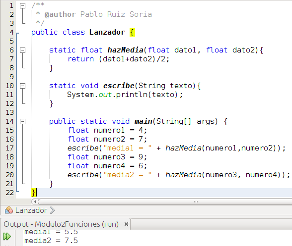

# Funciones

En este apartado vamos a hablar de las **funciones**, también llamadas **procedimientos**, y vamos a nombrar los **métodos** pero estos últimos los veremos en mayor profundidad en el módulo 3.

Una función es un trozo de código definido por un nombre a la cual se le pueden pasar parámetros o no y que puede o no devolver un valor.

Como primera aproximación a los métodos vamos a indicar que son algo muy parecido a una función pero ligado a un objeto. En el siguiente módulo profundizaremos en los métodos.

Vamos a ver unos trozos de códigos para comentarlos mas adelante:

Ahora vamos a ver como hacer esto con una función:

Y vamos a ver que hacemos y porqué. Lo primero es indicar que ambos códigos hacen lo mismo como podemos ver en la salida del programa sin embargo en la 2ª imagen entre las líneas 6 y 8 creamos una función que devuelve un float, tiene por nombre hazMedia y necesita 2 parámetros de tipo float. Esta función realiza la media de ambos datos y la retorna. En el segundo programa, en las líneas 13 y 17, vemos que para llamar a esta función es suficiente con indicar a que variable vamos a asignarle el valor devuelto y facilitar las variables con las que queremos que se haga el cálculo. Este ejemplo es trivial, pero si pensásemos en funciones mas complejas veríamos que al sacar factor común del código repetido este queda mucho mas simple y legible, además, si utilizamos una función estamos siguiendo el principio DRY (Don't Repeat Yourself, no te respitas) que nos va a permitir el que en caso de tener que realizar un cambio en el algoritmo únicamente haya que hacerlo en la función y no en todos los sitios donde aparezca el código no llevado a la función.

Vamos a ver ahora el código de una función que no devuelve nada:

En Java podemos hacer uso de la recursividad en las funciones, a continuación tenemos un ejemplo:

