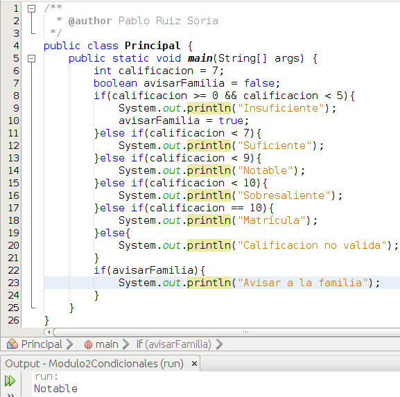
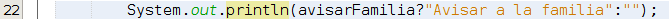
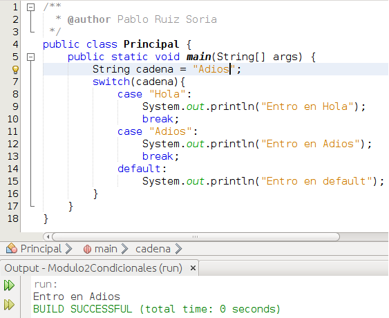

# Funciones condicionales

# Funciones condicionales

Existen 2 funciones condicionales: **if/else if/else** y **switch**.

Vamos a comenzar por la estructura **if/else if/else**. En esta estructura la sintaxis es la siguiente:

```java
if(condicion){  
    sentencias;  
}else if(condicion){  
    sentencias;  
}else{  
    sentencias;  
}
```

De la estructura anterior es obligatorio que exista siempre el if. else if puede haber 0 o varios. else puede haber 1 o 0. Y el funcionamiento es el siguiente. Cuando el compilador llega a la condición del if y la evalúa, si la condición es verdadera ejecutará las sentencias ubicadas dentro del if y habrá terminado con la estructura if/else if/else, ya no ejecutará sentencias de otros bloques aunque estas sean verdad. Si la condición del if es falsa se evalúa la condición del else if y si es verdadera se ejecutan las sentencias ubicadas dentro, en caso de ser falsa se evalúa el siguiente else if si lo hubiera. Si la condición de algún else if fuese verdadera se ejecutarían las sentencias de su interior y ya no se evaluarían ni ejecutarían mas condiciones de toda la estructura if/else if/else. En caso de que ninguna condición del if o los else if fuese verdadera y hubiese un bloque else se ejecutarían las sentencias contenidas dentro del bloque else.

Vamos a ver a continuación un ejemplo de 2 estructuras if/else if/else ya que es mas sencillo comprender esta estructura leyendo el código que tratando de explicarlo.





Cuando el programa llega al if de la línea 8 se comprueba si la variable calificacion es mayor o igual a 0 (lo es) y que la variable calificacion sea menor a 5 (no lo es). Como el resultado de true && false es false no entramos dentro de sus llaves y se pasa a evaluar la condición de la línea 11. En la línea 11 se evalúa si la variable calificacion es menor a 7 (no lo es), al ser falsa se pasa a evaluar la condición de la línea 13. En la línea 13 se evalúa si la variable calificacion es menor a 9 (lo es), al ser verdad se ejecutan todas las sentencias ubicadas dentro de sus llaves, en ese caso solo hay 1 sentencia y se escribe Notable en consola. Como la condición de la línea 13 es verdad ya no se comprueban las condiciones de las líneas 15, 17 o 19 y se salta directamente a la línea 22.

En la línea 22 tenemos otra condición así que se evalúa si la variable avisarFamilia es true (no lo es), al ser falso no se ejecuta el código de su interior y al no haber ningún else if ni else se da por terminado este if.

Existe también la posibilidad de ejecutar esta estructura con la sintaxis:

```java
condicion?valorSiCondicionVerdadera:valorSiCondicionFalsa;
```

Vamos a ver un ejemplo que sustituiría al código comprendido entre las líneas 22 a 24 de la imagen anterior





Se va a escribir algo por pantalla ¿el qué? dependerá del resultado que produzca la variable avisarFamilia, si la variable avisarFamilia es verdadero se devolverá "Avisar a la familia" y será eso lo que se escriba. Si la variable avisarFamilia es falso se devolverá lo que está tras los 2 puntos, es decir, "" y se escribirá una línea vacía.

* * *

Una vez vista la estructura if/else if/else vamos a continuar con la estructura **switch**. Su sintaxis es la siguiente:

```java
switch(expresión){
    case valor1:
        Sentencias;
        break;
    case valor2:
        Sentencias;
        break;
    default:
        Sentencias;
}
```

De la sintaxis anterior es obligatorio utilizar la primera línea y la última y debe haber al menos 1 case con sus sentencias y un break tras las sentencias. El elemento default es opcional. Como quizás resulte algo complejo de explicar teóricamente vamos a ver un ejemplo:





En la línea 7 indicamos a nuestro switch que la variable de referencia es cadena. En la línea 8 comprobamos si "Hola" es igual a cadena y como no lo es pasamos al siguiente case, al de la línea 11. En la línea 11 se evalúa si la variable cadena es igual a "Adios" y como lo es entramos a ejecutar todas las sentencias ubicadas dentro de nuestro case, en este caso la de la línea 12. Luego llegamos a la línea 13, donde nos encontramos un break, este break nos lanza fuera del switch, a la línea 16. Si olvidásemos añadir el break de la línea 13 se ejecutaría la sentencia de la línea 12 y luego la sentencia de la línea 15 por ello hay que finalizar cada case con break.

Si hablamos de la **eficiencia interna** de cada una de estas estructuras condicionales la documentación de Java indica que es mas óptimo hacer uso de switch si bien es cierto que en los desarrollos que realicemos en el aula con nuestro alumnado no vamos a notar la diferencia de rendimiento.

