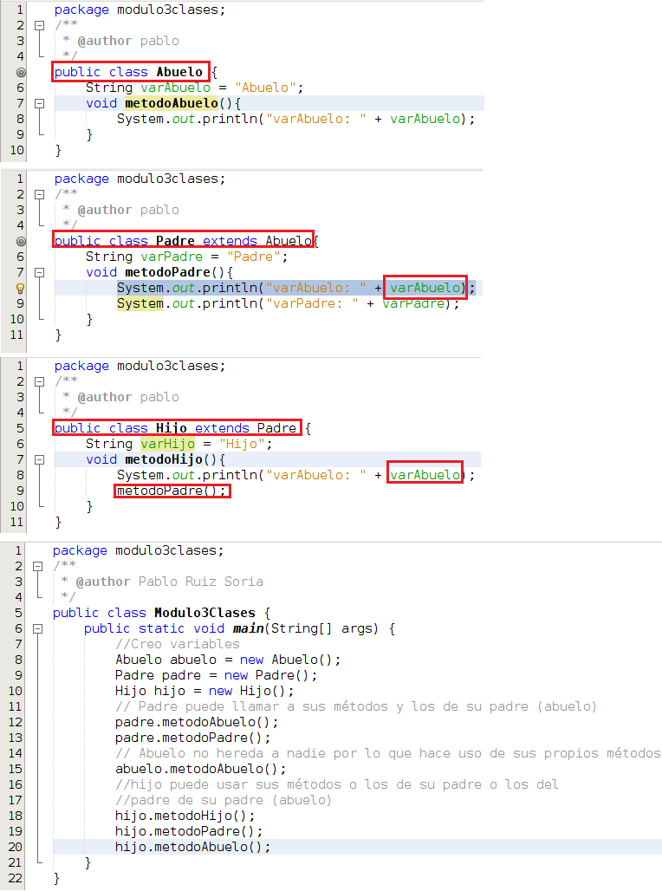
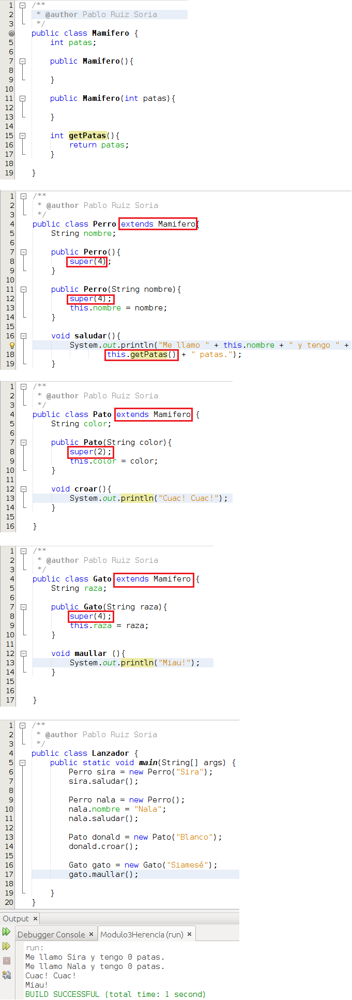

# Herencia

Una de las características de un lenguaje de programación orientado a objetos es la **herencia**. En algún capíutlo anterior a este ya hemos visto alguna funcionalidad de la herencia, pero de aquí en adelante vamos a profundizar en ella.

En POO, la herencia es un mecanismo que nos permite extender las funcionalidades de una clase ya existente. De este modo vamos a favorecer la **reutilización** de nuestro código.

La sintaxis cuando queremos heredar de una clase es la siguiente:

```java
class nombreClase extends nombreClaseQueQueremosExtender {
```

Hay que indica que **solo podemos heredar de una clase a la vez**. Llamaremos **superclase** a la clase padre y **subclase** a la clase que hereda.

La herencia nos va a acerca a otros conceptos como el **polimorfismo** y la **sobrescritura de métodos** que trataremos a lo largo de este módulo. También va a traer consigo la utilización de nuevas palabras reservadas como **extends** o **super**.

¿Qué ocurre cuando una clase hereda de otra? Pues que la subclase tiene acceso (en función del control de acceso que veremos mas adelante) a los métodos y atributos de la superclase. Vamos a ver un ejemplo a continuación:





Lo que vemos en el código anterior son 4 clases públicas (Abuelo, Padre, Hijo y Modulo3Clases. La clase Abuelo la definimos en la línea 4 de su código y **al no usar la palabra reservada extends no hereda nada mas que de la clase Object**. En la clase Abuelo definimos una variable y un método. En la línea 5 de la clase Padre indicamos que esta clase extiende a Abuelo con lo que **hereda de dicha clase y puede hacer uso de las variables y médotos** de Abuelo además de los suyos propios. La clase Hijo hereda de Padre (que a su vez heredaba de Abuelo) por lo que en la clase Hijo tendremos acceso tanto a las variables y métodos de Padre como los de Abuelo. En la clase Padre ya hacemos uso de una variable de Abuelo en su línea 8. En la clase Hijo hacemos uso de una varible de Abuelo en la línea 8 y un método de la clase Padre en la línea 9. Por último, tenemos la clase Modulo3Clases que contiene el método main. En las líneas 8 a 10 creamos los objetos de tipo Abuelo, Padre e Hijo. Estos objetos son los que nos dan acceso al código asociado a la clase. En la línea 12 y 13 vemos como desde el objeto padre tenemos acceso a métodos de la clase Abuelo y de la propia clase Padre. Lo mismo ocurre con el objeto hijo en las líneas 18 a 20.

El ejemplo anterior símplemente pretende ilustrar la herencia de atributos y métodos pero ahora vamos a ir un poco mas allá. Vamos a pensar en perros, patos, gatos y vamos a tratar de abstraernos sobre lo que son. Todos ellos son mamíferos y tienen una determinada cantidad de patas. Probablemente todos ellos realicen las mismas acciones. Por ello voy a crear una clase llamada Mamifero con los atributos y métodos comunes y luego crearé una clase para cada animal que contenga sus peculiaridades. Vamos allá:





En la clase Mamifero no hay nada reseñable, contiene 1 atributo, 2 constructores y 1 método. La clase Perro en la línea 4 indica que hereda de la clase Mamifero (extends Mamifero), tiene 1 atributo propio y 1 atributo que hereda, tiene 2 constructores y tiene 1 método propio. Dentro de los 2 constructores veo escrito super(4), esto lo que hace es llamar al constructor de su superclase que tiene 1 parámetro de tipo entero, es decir, hace uso del constructor de Mamifero. Dentro del método saludar vemos que existe 1 llamada a un método heredado (getPatas()). La clase Pato tiene 1 atributo propio y 1 atributo que hereda y tiene 1 contrctor y 1 método propio. En el constructor también referencia al constructor de la superclase (con super(2)) y en este caso no hace uso del método que hereda. La clase Gato es prácticamente equivalente a la clase Pato. Si nos fijamos en Lanzador vemos que tenemos la función main y en ella creamos 4 objetos.

En el ejemplo anterior hay que recordar que el hecho de que una clase no indique explícitamente que hereda de ninguna otra implica que dicha clase hereda de Object. Es decir, en el ejemplo anterior Mamifero hereda de Object. Como Perro hereda de Mamifero y Mamifero hereda de Object la clase Perro tendrá acceso a sus propios atributos y métodos y a los de Mamifero y Object.

Vamos a llevar nuestro ejemplo un poco mas allá. Vamos a pensar que quisiésemos organizar un concurso de animales en el cual pudiesen apuntarse un máximo de 100 animales siendo que solo pueden participar perros, patos y gatos ¿haríamos una lista para cada animal? Vamos a ver en el siguiente capítulo como el **polimorfismo** puede ayudarnos.

