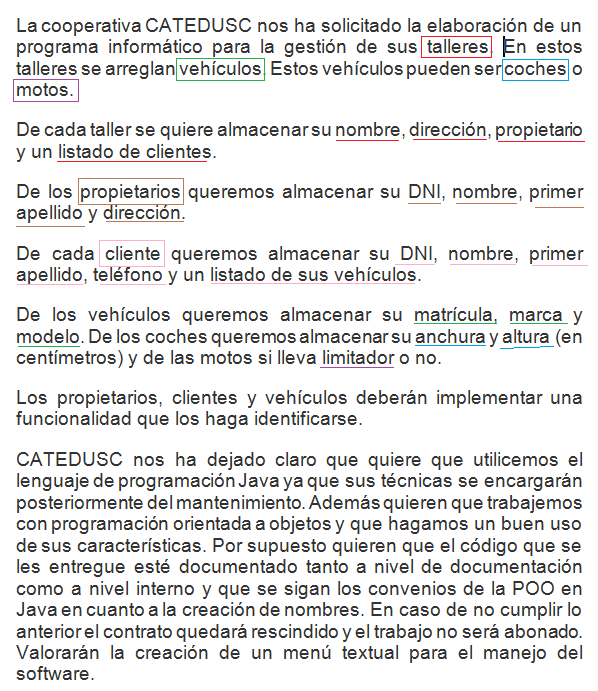
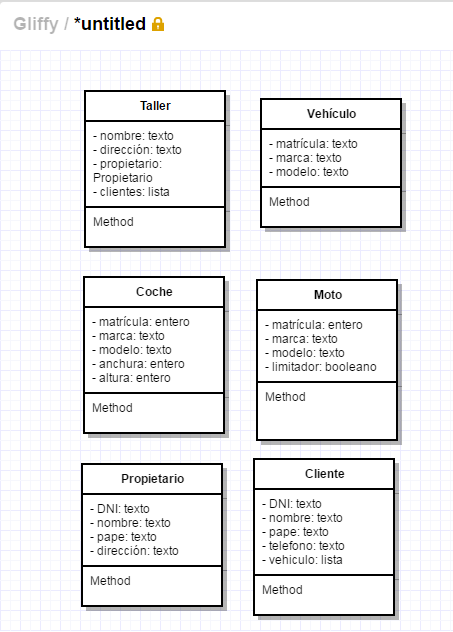

# Identificación de las clases

Mi consejo para los primeros programas en los que vayáis a trabajar con programación orientada a objetos es que os imprimais el enunciado del problema y con un lápiz pongáis un recuadro sobre aquellos elementos que defináis como un objeto y subrayéis aquellos elementos que identifiquéis como atributos del mismo.

En la imagen superior vemos que identifico las clases Taller, Vehículo, Coche, Moto, Propietario y Cliente y una serie de atributos para clase. He subrayado del mismo color los atributos que corresponden a cada clase, la cual he recuadrado en ese mismo color.

Una vez hemos identificado las clases y sus atributos lo ideal sería utilizar algún modo estandar de representarlo. Yo he optado por utilizar un [lenguaje unificado de modelado (UML)](https://es.wikipedia.org/wiki/Lenguaje_unificado_de_modelado "UML") para esta tarea y concretamente lo relativo a los [diagramas de clases](https://es.wikipedia.org/wiki/Diagrama_de_clases "Diagramas de clases") que es la tarea que nos ocupa. Con UML cada clase estará contenida en un recuadro que dividiré horizontalmente en 3 recuadros. En el recuadro superior escribiré el nombre de la clase, en el recuadro inferior los atributos de la clase y en el recuadro inferior los métodos de la clase. Vamos a ver como quedarían nuestras clases dibujadas de este modo.

En la imagen superior vemos el modo en que dibujaríamos las clases de nuestros problema. El campo para los métodos de momento lo he dejado vacío. En los atributos, antes de su nombre, he puesto el símbolo - para indicar que se trata de un atributo privado y cumplir así los criterios de encapsulación cuando cree los getters y setters correspondientes. 

Podemos crear diagramas de clases con la aplicación web [https://www.gliffy.com/uses/uml-software/](https://www.gliffy.com/uses/uml-software/ "UML")

En el siguiente apartado vamos a redefinir este diagrama para ver si de algún modo existe herencia y las distintas relaciones entre las clases.

