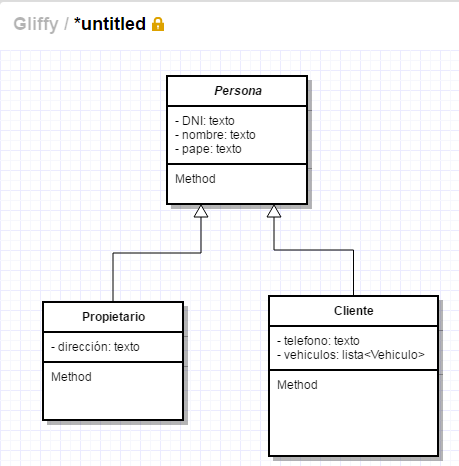
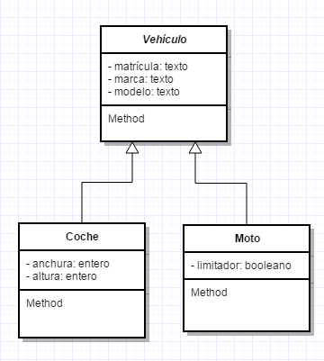
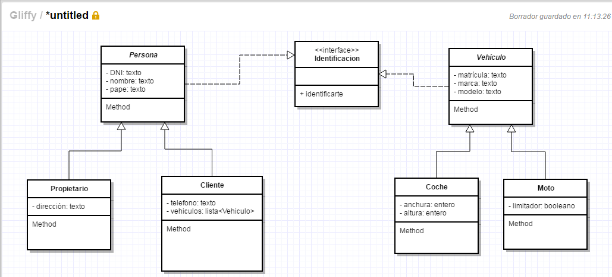
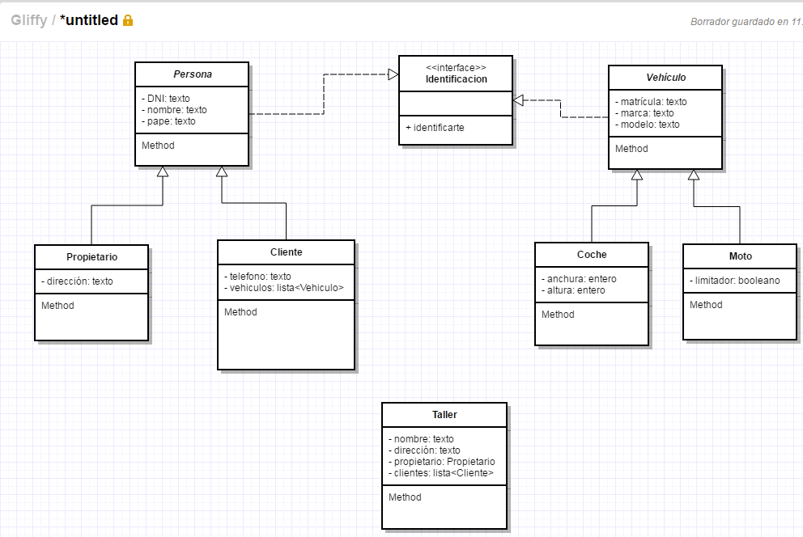
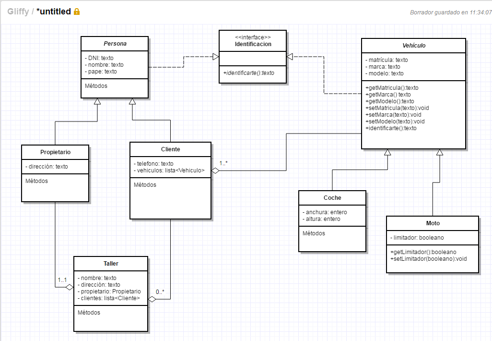

# Jerarquía de clases

Si analizamos el diagrama de clases que hemos realizado en el apartado anterior observamos que los clientes y los propietarios comparten parte de sus atributos por lo que podríamos crear una abstracción que llamásemos Persona que tuviese estos campos y que posteriormente Propietario y Cliente heredasen de ella. Vamos a ver como quedaría.

Fíjate que en la imagen anterior la clase Persona, al considerarla abstracta, escribimos su nombre con letra cursiva. Consideramos la clase Persona abstracta porque no vamos a tener que crear en ningún momento instancias de de ella.

De modo análogo ocurre con Vehículo, Coche y Moto. A fin de cuentas comparten una serie de atributos, podemos "sacar factor común" haciendo que Coche y Moto herenden de Vehículo tal y como vemos en la imagen posterior.

Igual que antes Vehículo es una clase abstracta y como tal escribimos su nombre en cursiva. Coche y Moto extenderán a Vehículo.

En el enunciado de nuestro problema se dice "Los propietarios, clientes y vehículos deberán implementar una funcionalidad que los haga identificarse.", esto debería ser un método pero ¿en que clase lo coloco? Es algo que tanto las personas como los vehículos deben implentar ¿pongo el método una vez en cada clase? La solución a nuestras dudas es crear una interface que vamos a llamar Identicación y haremos que tanto Persona como Vehículo implementen esta clase. Vamos a ver como dibujaríamos esta interface y la relación entre ella, Persona y Vehículo.

Observa que la línea entre las clases es en este caso discontinua mientras que cuando expresamos herencia es una línea continua.

Si comparamos nuestro esquema actual con nuestro primer esquema observaremos que nos falta la clase Taller así que vamos a añadirla a nuestro esquema.

Casi hemos terminado. De algún modo tenemos que expresar la composición entre clases y la cardinalidad existente. Es decir, si nos fijamos en la clase Cliente vemos que está compuesta por una lista de Vehículos, tenemos que expresarlo de algún modo, además, cada cliente deberá tener al menos 1 vehículo. Si nos fijamos en Taller vemos que está compuesto tanto por Propietario (cada taller tiene 1 único propietario) como por una lista de clientes que serán 0 o mas. Vamos a ver como representar esta composición y cardinalidad.

Con esto tendríamos terminado nuestro esquema de clases donde podemos observar la jerarquía de clases existente y las relaciones que existen entre ellas. Faltaría añadir en cada clase los métodos que tiene donde pone Métodos. Únicamente los he añadido en las clases Identificacion, Vehículo y Moto.

Con esto únicamente nos quedaría codificar nuestro esquema, pero esto lo haremos en el siguiente capítulo.

