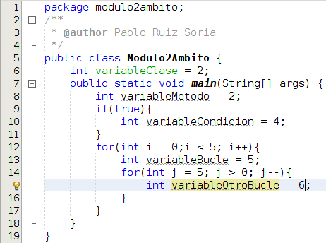

# Ámbito

Las variables y constantes tienen asociado un [ámbito](https://es.wikipedia.org/wiki/%C3%81mbito_(programaci%C3%B3n)). Simplificando, el ámbito indica donde existen y por tanto pueden utilizarse. A continuación voy a tratar de explicarlo con un extracto de código.

En el código que tenemos en la imagen anterior en la línea 6 declaramos la variable variableClase cuyo ámito es toda la clase, es decir, desde cualquier punto de la clase podríamos acceder a ella. En la línea 8 declaramos la variable variableMetodo, el ámbito de esta variable es el método main, es decir, puede ser accedida desde dentro del main pero no en otros métodos de la clase. En la línea 10 declaramos otra variable llamada variableCondicion cuyo ámbito es el bucle if, no es accesible desde ningún otro lugar. En la línea 12 declaramos la variable de nombre i que es accesible dentro de todo el bucle. En la línea 13 declaramos la variable variableBucle con la que ocurre lo mismo que con i. En la línea 14 declaramos la variable j cuyo ámbito es el bucle anidado y es únicamente accesible desde este bucle pero no del otro. Lo mismo ocurre en la línea 15 con la variable variableOtroBucle.

## Pregunta Verdadero-Falso

<quiz name=""><question>
En el ejemplo de código anterior, podría sustituir la línea 10 por System.out.println(variableClase); ya que la variable variableClase es accesible desde la línea 10
<answer correct>Verdadero</answer><answer>Falso</answer><explanation>variableClase es accesible desde toda la clase Modulo2Ambito y la línea 10 está dentro de la clase por lo que es accesible.</explanation></question><question>
En el ejemplo de código anterior, podría añadir al final de la línea 6 System.out.println(variableBucle); ya que la variable variableBucle es accesible desde la línea 6
<answer>Verdadero</answer><answer correct>Falso</answer><explanation>variableBucle solo está accesible dentro del bucle que está entre las líneas 12 y 17 por lo que no es accesible en la línea 6 y obtendríamos un error de compilación.</explanation></question></quiz>

