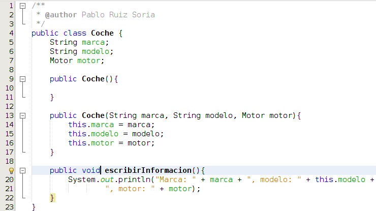
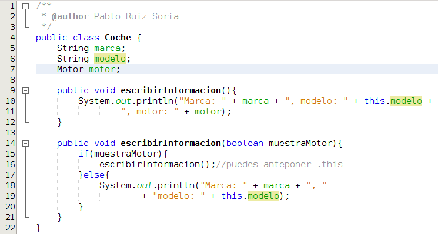

# Métodos

En el módulo 2 de este curso estuvimos hablando de las funciones. **Un método es** básicamente **lo mismo que una función pero asociado a un objeto**. Cuando en el siguiente apartado de este módulo hablemos de la palabra reservada static espero aclarar mejor esta diferenciación.

La sintaxis es básicamente la misma que en las funciones.

Vamos a ver un ejemplo:

En el ejemplo anterior aparece un método entre las líneas 19 y 22. El método es de acceso público (public), no devuelve nada (void), se llama escribirInformacion y no tiene parámetros. El método tiene una única sentencia que ocupa las líneas 20 y 21 y que muestra por pantalla un texto. Fíjate que puedes acceder a los atributos de la clase con o sin this.

En Java, **dentro de una clase puedes tener 2 métodos que se llamen igual siempre y cuando el número de parámetros que utilicen o el tipo varíe**. A continuación tenemos un ejemplo:

En el ejemplo anterior vemos que dentro de la misma clase tenemos 2 métodos que se llaman igual (escribirInformacion. Podemos tenerlos porque en la línea 9 definimos uno de ellos sin parámetros y en la línea 14 definimos otro con un solo parámetro de tipo boolean. Podríamos tener otro mas de un solo parámetro siempre y cuando este no fuera de tipo boolean.

En Java existe la [**sobreescritura de métodos**](https://es.wikipedia.org/wiki/Herencia_(inform%C3%A1tica). Esto significa que cuando una clase hereda de otra se puede sobreescribir los métodos de esta. Lo veremos con mas detalle en el apartado de herencia.

Si eres observador/a te habrás dado cuenta de que cuando creo un método no uso la palabra reservada static como hacía con las funciones, en el siguiente capítulo voy a tratar de explicarte el porqué.

