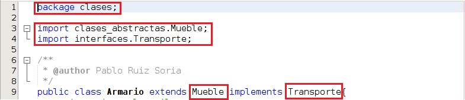
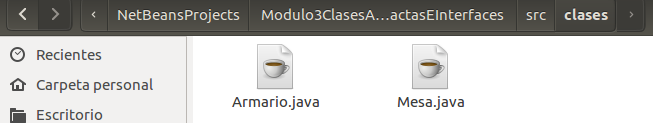
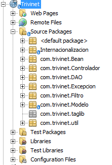

# Organización del código: Paquetes

**Un paquete es una agrupación lógica de clases o interfaces relacionadas**. La creación de paquetes nos permite dotar a nuestro código de mayor protección a través del control de acceso y además nos permite facilitar la organización de nuestros programas. Si pensamos en los ficheros con los que trabajamos a diario no los dejamos todos sueltos en el escritorio sino que creamos una serie de carpetas/directorios donde los agrupamos de modo lógico con el fin de facilitar nuestra organización.

El convenio dice que los paquetes deben nombrarse en minúsculas y cuando se necesitan usar varias palabras separarlas por un guión bajo. Además, suele utilizarse el dominio de nuestra empresa invertido, de este modo, podemos diferenciar clases que compartan nombre.

Para indicar que una clase pertenece a un determinado paquete debemos indicarlo usando package nombreDelPaquete y ubicando la clase dentro de dicha ruta de carpetas. Vamos a ver un ejemplo:

Por lo que la clase Armario deberá estar ubicada en la carpeta clases

Cuando en nuestros programas queremos usar una clase que no pertenece a nuestro paquete (y tenemos permiso para ello) existen 2 posibilidades:

*   Importar la clase, tal como vemos en las líneas 3 y 4 de la imagen anterior
*   Referenciarla completamente cada vez que vayamos a usarla. Eliminaríamos las líneas 3 y 4 y cada vez que quisiesemos hacer referencia a Mueble escribiríamos clases_abstractas.Mueble y cada vez que quisiésemos hacer referencia a Transporte escribiríamos interfaces.Transporte

A continuación vamos a ver la organización en paquetes de un proyecto real, el proyecto a partir del cual se desarrolla el recurso didáctico [trivinet.com](https://www.trivinet.com/ "trivinet")

El proyecto de la imagen está formado por 80 clases agrupadas en 9 paquetes distintos en función de las funcionalidades que cada clase tiene.

Java nos proporciona una cantidad de paquetes enormes lista para utilizar en nuestros paquetes, esta librería recibe el nombre de API (Application Programming Interface) La especificación completa del API de Java 8 para su edición estándar está accesible [aquí](https://docs.oracle.com/javase/8/docs/api/index.html "API Java 8").

