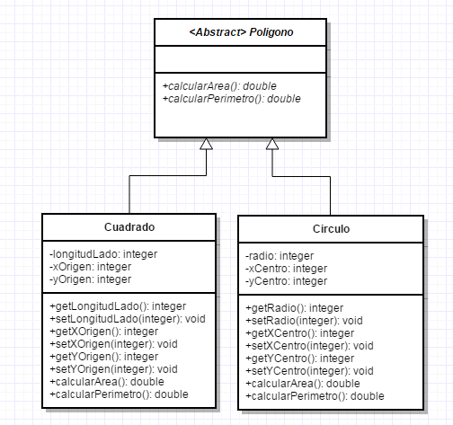

# Pintemos en Java

En este vídeo vamos a trabajar con las características de la POO (clases abstractas, herencia, polimorfimo) y vamos a hacerlo a través de una interfaz gráfica de usuario. Además, en esta interfaz gráfica de usuario, vamos a dibujar los objetos con los que vamos a trabajar. El enunciado de nuestro problema dice:

> Para trabajar la unidad didáctica de geometría vamos a desarrollar una aplicación informática que nos permita trabajar con polígonos, concretamente queremos trabajar con cuadrados y cículos. De cualquier polígono queremos poder calcular su área y perímetro. De los cuadrados queremos almacenar su longitud de lado y el punto (x e y) que lo define en su posición superior izquierda. De los círculos queremos almacenar su centro (x e y) y su radio. En la aplicación deberemos de poder crear cualquiera de estos 2 elementos, listarlos (viendo el área de los cuadrados y el perímetro de los círculos) y dibujar todos los polígonos que tengamos. Todo hecho deberemos hacerlo haciendo un buen uso de las características de la POO. Por simplicidad, no es necesario controlar las excepciones ni que los valores de los lados son positivos.

El diagrama de clases resultante del enunciado anterior sería el siguiente:

Vamos a ver como implementarlo en el siguiente vídeo:

https://youtu.be/o330-623xrI
