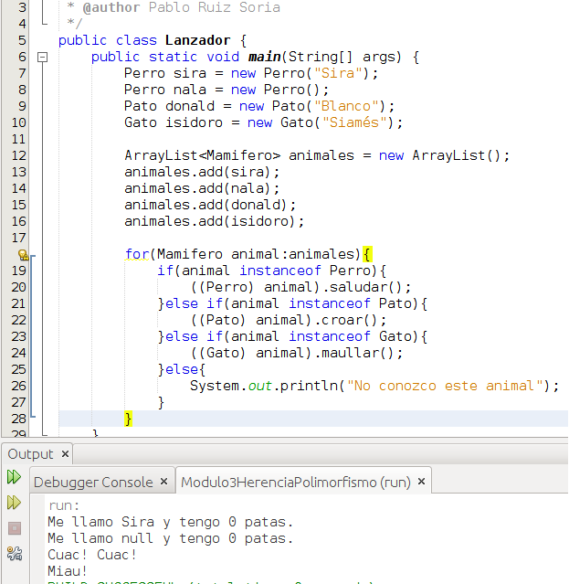

# Polimorfismo

El polimorfismo es la capacidad que nos proporciona un lenguaje de programación orientado a objetos para tratar un objeto como si fuera un objeto de otra clase.

Existen lenguajes de programación donde una variable puede contener prácticamente cualquier tipo de dato, es el caso de los lenguajes PHP, Python y Javascript (recuerda, Javascript no es Java, son lenguajes distintos), mientras que existen otros lenguajes de programación en los que una variable definida de un modo solo pude contener variables de dicho tipo, es el caso de Java. Java es un [lenguaje fuertemente tipado](https://es.wikipedia.org/wiki/Tipado_fuerte "lenguaje fuertemente tipado").

Debido a este fuerte tipado en ocasiones nos encontramos con que tenemos que moldear un determinado objeto de modo que quepa en el molde de otro, para ello utilizaremos el llamado [**casting** o **typecasting**](https://es.wikipedia.org/wiki/Conversi%C3%B3n_de_tipos "Typecasting").

Vamos a ver un ejemplo

El ejemplo anterior no cambia en nada las clases Perro, Pato y Gato utilizadas en el ejemplo visto en el apartado Herencia. Todos los cambios ocurren en la clase Lanzador. Si nos fijamos en ella vemos que en la línea 12 creamos un ArrayList en la cual indicamos que vamos a añadir objetos de la clase Mamifero sin embargo en las líneas 13 y 14 vemos que añadimos 2 objetos de tipo Perro, en la línea 15 un objeto de tipo Pato y en la línea 16 añadimos un objeto de tipo Gato. En este caso el compilador realiza un **casting implícito** ya que todos los tipos anteriores son descendientes de Mamifero. Si en lugar de crear un ArrayList<Mamifero> huviesemos creado un ArrayList<Perro> entonces no habríamos podido insertar al pato ni al gato. Prosigamos, en la línea 18 nos encontramos con un bucle for mejorado que recorreraá todos los elementos del array y los guardará en una variable llamada animal de tipo Mamifero. Vemos que en las líneas 19, 21 y 23 usamos una palabra reservada nueva (instanceof), esta palabra lo que hace es devolver verdadero en caso de que la variable animal sea una instancia de Perro, Pato o Gato respectivamente. Cuando la condición es cierta entramos dentro del if y se realiza un **casting explícito**, es decir, le decimos que comportamiento queremos que tenga ese objeto para que así podamos acceder a sus métodos y atributos. En la línea 20 nos encontramos ((Perro) animal).saluda(); aquí lo que ocurre es que se realiza el cast sobre animal para que se comporte como si fuera de tipo Perro y una vez que se ha realizado el cast y ya no es de tipo animal sino que es de tipo Perro, entonces es cuando tenemos acceso al método saludar y no antes. Ocurre lo mismo en las líneas 22 y 24.

En nuestro ejemplo de herencia y polimorfismo hemos creado una clase (Mamifero) que queríamos sirviese de base para otras (Perro, Pato y Gato) pero que no hemos llegado a utilizar. En el capítulo Clases abstractas e interfaces veremos cual habría sido la forma mas adecuada de diseñar esta jerarquía de clases.

## Pregunta Verdadero-Falso

<quiz name=""><question>
Java y Javascript son el mismo lenguaje de programación. Nos referimos a Javascript como Java para tener un lenguaje mas fluido.
<answer>Verdadero</answer><answer correct>Falso</answer><explanation>Java y Javascript son lenguajes de programación distintos. Su sintaxis es parecida al igual que ocurre entre C# y Java o entre C++ y Java.</explanation></question><question>
En el ejemplo anterior, sería correcto escribir Gato gato = (Gato) nala;
<answer>Verdadero</answer><answer correct>Falso</answer><explanation>No podría hacerse lo que se indica en la pregunta ya que nala es un objeto de tipo Perro que hereda de Mamifero y Gato hereda de Mamifero. En la jerarquía de clases derivan de la clase Mamifero pero a partir de ese momento son ramas distintas de la jerarquía. Si podría hacer Mamifero mamifero = (Mamifero) nala;</explanation></question></quiz>

