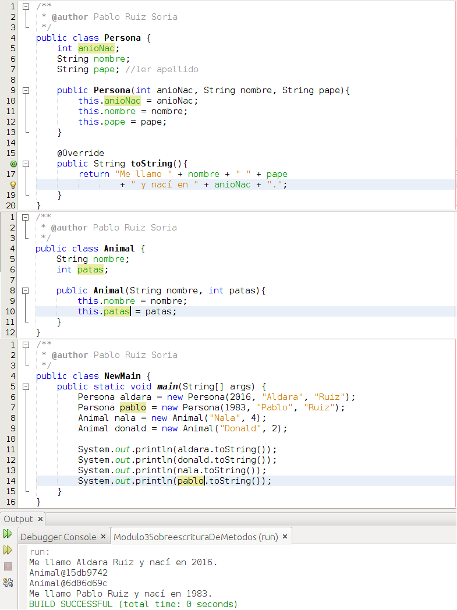
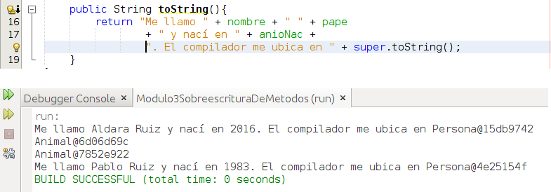

# Sobreescritura de métodos

Otra característica asociada a la herencia es la **sobreescritura de métodos**. La wikipedia se refiere a ella como [redefinición de métodos](https://es.wikipedia.org/wiki/Herencia_(inform%C3%A1tica) pero yo nunca la he visto denominada de ese modo con anterioridad.

Cuando dentro del apartado Clases estuvimos hablando de los métodos nombramos por primera vez la sobreescritura de métodos. No hay que confundir la sobreescritura de métodos con que un mismo método pueda ser definido de modos distintos.

La sobreescritura de métodos nos permite redifinir un método que heredamos para que este funcione de acuerdo a nuestras necesidades y no a lo definido en la superclase. Cuando en un objeto llamamos a un método el compilador comprueba si el método existe en nuestro objeto, si existe lo usa y si no existe en nuestro objeto entonces lo busca en la superclase. Esto ocurre así hasta que el compilador encuentra el método definido. El compilador busca el método de abajo a arriba.

Vamos a ver un ejemplo

Por simplicidad he decidido escribir 2 clases (Persona y Animal) que al no usar la palabra reservada extended derivan implicitamente de la clase Object. Si miramos la documentación de Object veremos que tiene un método llamado [toString](https://docs.oracle.com/javase/8/docs/api/java/lang/Object.html#toString-- "toString"). Este método lo que hace es indicar la dirección de memoria en que el compilador ha guardado el objeto. En la clase Persona en las líneas 15 a 19 he redefinido el método toString dándole un comportamiento distinto mientras que en la clase Animal no lo he redefinido. Si volvemos a la clase Persona vemos que en la línea 15 aparece una [anotación](https://es.wikipedia.org/wiki/Anotaci%C3%B3n_Java "Anotación") que le indica que estamos sobreescribiendo el método, esta anotación no es necesaria pero en teoría agiliza la compilación y ejecución de nuestros programas. Si vamos a la función main vemos que en las líneas 6 a 9 creamos los objetos y en las líneas 11 a 14 llamamos al método toString de dichos objetos. En el caso de los objetos de tipo persona se ejecuta el método que hemos redefinido mientras que en los objetos de tipo animal se utiliza el método de la superclase.

Cuando redefinimos un métodos podemos hacer uso del propio método que estamos redefiniendo, para ello haremos uso de la palabra reservada super. Voy a modificar el código del ejemplo anterior para que podamos verlo:

En el extracto anterior vemos que he añadido super.toString() para decirle a mi método toString que llame al método toString de la superclase. Debajo del código aparece el resultado que se produce al ejecutar el programa tras el cambio.

